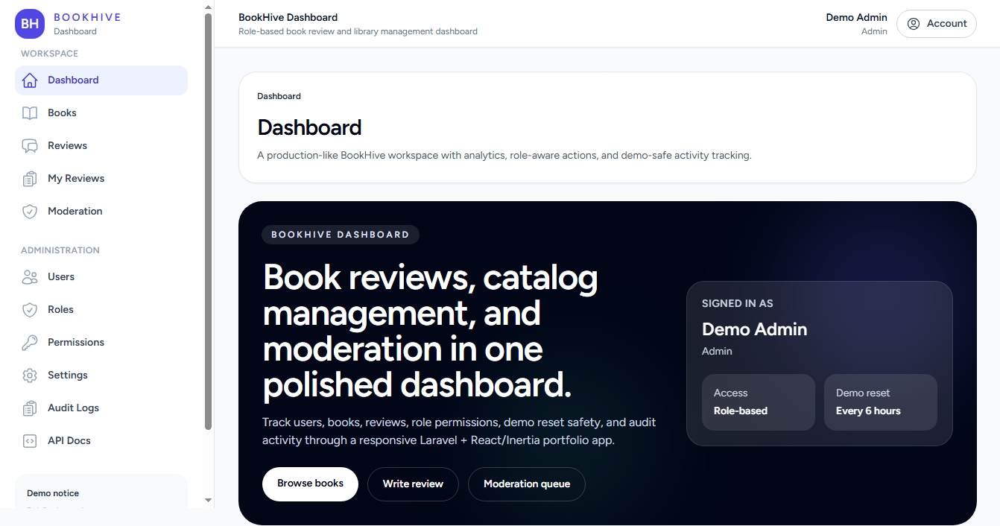
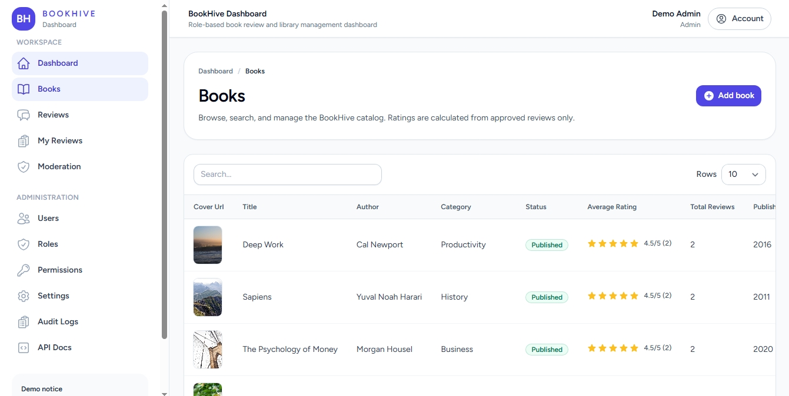
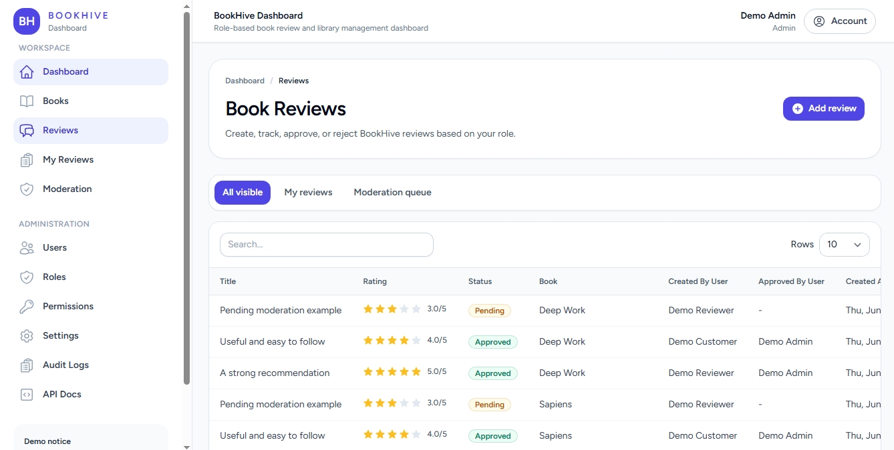
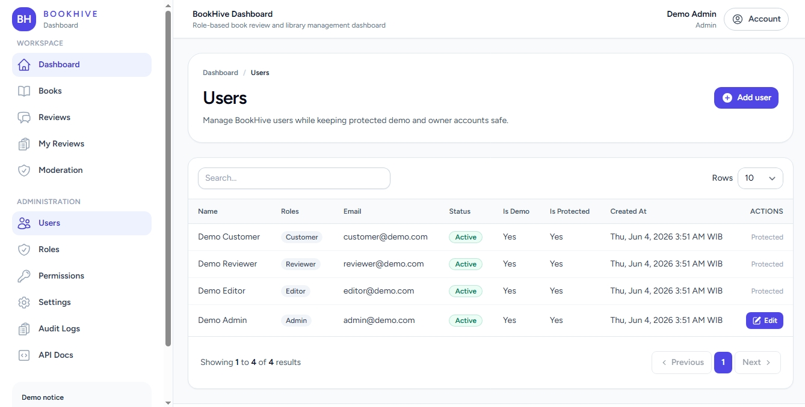
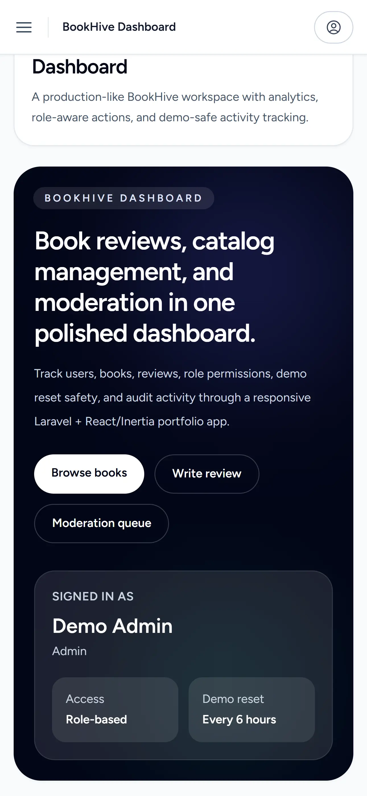

# BookHive Dashboard

A Laravel, React, and Inertia.js book management platform with role-based access, review moderation, JWT API, Redis caching, Docker, and automated testing.

- [Live Demo](https://bookhive-dashboard.frengkipurba.com/)
- [Postman Documentation](docs/postman/README.md)
- [Postman Collection](docs/postman/BookHive_API.postman_collection.json)

---

## Project Overview

**BookHive Dashboard** is a production-oriented full-stack portfolio application designed for book catalog management, user reviews, and editorial moderation. Built as a modern monolith using Laravel 10 and React 18 via Inertia.js, the system features fine-grained Role-Based Access Control (RBAC), a dual authentication architecture (session-based web UI and stateless JWT API), Redis caching with targeted invalidation, and automated testing pipelines. The platform includes an automated demo environment reset engine to safely maintain public interactive demonstrations without compromising private owner data.

---

## Key Highlights

- **Backend Architecture**: Laravel 10 application running on PHP 8.2.
- **Frontend Experience**: Single-page application UI built with React 18, Inertia.js, Tailwind CSS, and Headless UI.
- **Access Control**: Fine-grained RBAC powered by Spatie Laravel Permission with 5 distinct role tiers.
- **Review Moderation Pipeline**: Multi-stage review lifecycle (pending, approved, rejected) with moderation audit notes.
- **Dual Authentication**: Session authentication for web users and Tymon JWTAuth bearer tokens for RESTful API clients.
- **Redis Caching Engine**: High-performance targeted caching using explicit keys and targeted invalidation after related write operations.
- **Containerized Environment**: Complete Docker Compose setup with Nginx, PHP 8.2-FPM, MariaDB 10.11, and Redis 7.
- **Quality Assurance**: Automated CI pipeline via GitHub Actions enforcing 47 feature and unit tests (166 assertions).

---

## Screenshots











---

## Core Features

### Book Management
- Full catalog management with title, author, category, publication year, and status control (`draft` / `published`).
- Cover image upload handling with public URL resolution and storage cleanup.
- Dynamic average rating aggregation calculated exclusively from approved user reviews.

### Review Workflow
- Authenticated review submission queuing reviews into a `pending` moderation state.
- Moderation dashboard allowing authorized staff to approve or reject reviews with explanatory notes.
- Strict ownership rules: users can only update or delete their own `pending` or `rejected` reviews. Approved reviews are immutable via public interfaces.

### Authentication and Authorization
- Dual auth system: Laravel Breeze session authentication for web UI and JWT bearer tokens for API clients.
- Spatie Laravel Permission integration managing 5 roles: `Super Admin` (Private Owner), `Admin`, `Editor`, `Reviewer`, and `Customer`.
- `Super Admin` acts as the private owner role, protected from deletion or privilege revocation.

### Demo Safety
- Pre-configured public demo accounts with protected status preventing accidental lockout.
- Automated and manual environment reset (`php artisan demo:reset`) restoring core seed data while preserving private owner credentials.

---

## Tech Stack

| Layer | Technologies |
| :--- | :--- |
| **Backend** | PHP 8.2, Laravel 10, Tymon JWTAuth, Spatie Laravel Permission |
| **Frontend** | React 18, Inertia.js, Tailwind CSS, Vite, Headless UI, Heroicons |
| **Infrastructure** | Docker Compose, Nginx (Alpine), MariaDB 10.11, Redis 7 (Alpine) |
| **Quality & Tools** | PHPUnit 10, GitHub Actions CI, Postman Collection v2.1 |

---

## Role Matrix

| Role | Primary Access & Responsibilities |
| :--- | :--- |
| **Super Admin** | Private owner account. Full system access, demo reset management, and system administration. |
| **Admin** | Manages users, roles, permissions, books, reviews, audit logs, and settings. Cannot modify Super Admin. |
| **Editor** | Manages book catalog entries and cover images. Views review queues without moderation privileges. |
| **Reviewer** | Explores book catalog, submits reviews, and manages personal pending/rejected reviews. |
| **Customer** | Explores published books, views approved reviews, submits reviews, and manages personal profile. |

---

## Live Demo & Demo Accounts

### Live Demo URL
[https://bookhive-dashboard.frengkipurba.com/](https://bookhive-dashboard.frengkipurba.com/)

### Safe Public Demo Accounts

| Role | Email | Password |
| :--- | :--- | :--- |
| **Customer** (Default) | `customer@demo.com` | `password` |
| **Reviewer** | `reviewer@demo.com` | `password` |
| **Editor** | `editor@demo.com` | `password` |
| **Admin** | `admin@demo.com` | `password` |

> ⚠️ **SECURITY WARNING**: These credentials are provided strictly for public demo exploration. Do not reuse these passwords for personal accounts. Private owner (`Super Admin`) credentials are stored securely in environment variables and are never published.

---

## Local Development with Docker

The primary recommended local development environment uses Docker Compose:

```bash
# 1. Clone repository
git clone https://github.com/frnqpur/bookhive-dashboard.git
cd bookhive-dashboard

# 2. Copy Docker environment configuration
cp .env.docker.example .env.docker
```

Generate a persistent `APP_KEY` before starting the containers (`docker/entrypoint.sh` requires `APP_KEY` to be set):

```bash
php -r "echo 'base64:'.base64_encode(random_bytes(32)).PHP_EOL;"
```

Copy the generated key into `.env.docker`:
```env
APP_KEY=base64:YOUR_GENERATED_KEY_HERE
```

Database migrations run automatically on container startup (`DOCKER_AUTO_MIGRATE=true`). For database seeding, choose one of two options:

- **Option A**: Set `DOCKER_AUTO_SEED=true` in `.env.docker` before starting containers, OR
- **Option B**: Run database seeders after starting containers: `docker compose exec app php artisan db:seed`

Build and start containers:
```bash
docker compose up -d --build
```

Access the application in your browser:
```text
http://localhost:8000
```

To stop containers:
```bash
docker compose down
```

---

## Manual Local Setup

As an alternative to Docker, you can run BookHive natively:

```bash
composer install
cp .env.example .env
php artisan key:generate
php artisan jwt:secret
php artisan migrate --seed
npm install
npm run dev
php artisan serve
```

Requirements: PHP 8.2, Composer 2, Node.js 20, MySQL/MariaDB, and Redis (optional if using `CACHE_DRIVER=file` or `array`).

---

## Testing

Run the automated PHPUnit test suite using Docker:

```bash
docker compose run --rm test
```

### Validated Test Results
```text
47 tests passed (166 assertions, 0 failures)
```

The test runner utilizes SQLite in-memory databases and isolated array cache drivers for zero-side-effect test execution.

---

## GitHub Actions CI

Continuous integration is automated via GitHub Actions ([.github/workflows/phpunit.yml](.github/workflows/phpunit.yml)):
- Triggers on pushes and pull requests to `main` and `feature/**` branches.
- Sets up PHP 8.2, Node 20, and SQLite in-memory test databases.
- Runs `composer install`, `npm ci`, `npm run build`, and executes the 47 PHPUnit test cases automatically.

---

## Redis Caching Architecture

BookHive employs targeted caching via the `App\Support\BookHiveCache` helper:
- **Public Contact Data**: `bookhive:settings:public_contact:v1` (TTL 86400s)
- **Admin Role Distribution**: `bookhive:dashboard:admin:users_by_role:v1` (TTL 3600s)

### Key Design Principles:
- **Explicit Keys**: Deterministic key naming without relying on `Cache::tags()`, compatible with the Redis, file, and array cache drivers used by the project.
- **Targeted Invalidation**: Proactive cache clearance triggered after related write operations (user registration, user creation/update/deletion, profile self-delete, setting updates, or demo reset).
- **No Global User Leakage**: Avoids caching user-specific or permission-dependent dashboard metrics globally.

---

## API Documentation

BookHive provides a complete RESTful API documented via Postman:
- [Postman Integration Guide](docs/postman/README.md)
- [Postman Collection (v2.1)](docs/postman/BookHive_API.postman_collection.json)
- [Postman Environment File](docs/postman/BookHive_Local.postman_environment.json)

### Main Canonical Endpoints:
- `POST /api/client/register` (Public registration)
- `POST /api/client/login` (Obtain JWT bearer token)
- `GET /api/client/me` (Authenticated user profile)
- `GET /api/client/books` (Paginated published books)
- `POST /api/client/books/{book}/reviews` (Submit pending review)
- `GET /api/health` (System health check)

All protected endpoints require `Authorization: Bearer <token>`. Tokens expire in 3600 seconds.

---

## Demo Reset Engine

Public demo environments can be reset safely to clean user-generated clutter while keeping system integrity intact:

```bash
php artisan demo:reset
```

### Safety Guarantees:
- Preserves the private `Super Admin` owner account and email/password settings.
- Restores core roles, permissions, default application settings, and sample books.
- Automatically clears managed Redis cache keys upon completion.

---

## Project Structure

```text
bookhive_dashboard/
├── app/                  # Controllers, Models, Middleware, Resources, Support
├── config/               # Application, Cache, Database, Auth configuration
├── database/             # Migrations, Seeders, Factories
├── docker/               # Nginx and PHP container configurations
├── docs/                 # Postman documentation & environment files
├── resources/js/         # React 18 + Inertia.js components & pages
├── routes/               # Web, API, Auth, and Console route definitions
├── tests/                # Feature & Unit PHPUnit test suite
├── .github/workflows/    # GitHub Actions CI workflow definition
└── docker-compose.yml    # Docker service definitions (App, Nginx, MariaDB, Redis)
```

---

## Security Notes

- No secrets, private credentials, or `.env` files are committed to version control.
- API endpoints enforce JWT bearer token verification and Spatie permission checks.
- Public registration restricts high-privilege `Super Admin` account creation.
- Postman documentation explicitly marks destructive requests and uses isolated local environment variables.

---

## Project Status

**Active Portfolio Project**

Completed Milestones:
- [x] Full-stack Inertia.js + React 18 Web Dashboard
- [x] Multi-tier RBAC & Review Moderation System
- [x] JWT API & Complete Postman Collection
- [x] Targeted Redis Caching Architecture
- [x] Docker Compose Local Infrastructure
- [x] Automated GitHub Actions CI Pipeline

---

## License

The project metadata in `composer.json` declares the MIT license. A standalone `LICENSE` file is not currently included in the repository.
