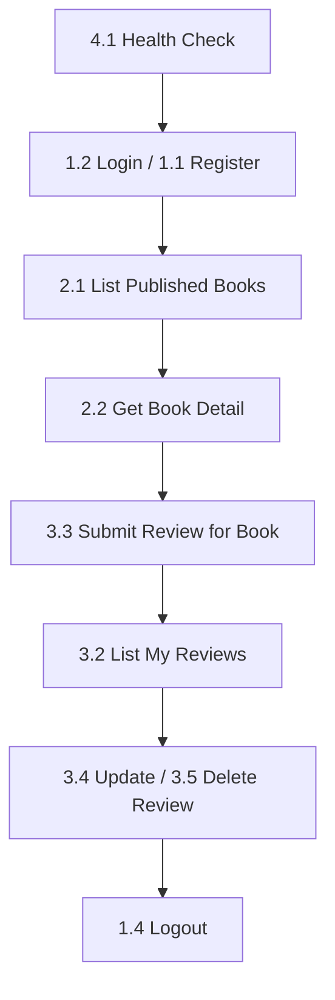

# BookHive Dashboard - Postman API Documentation

Panduan resmi penggunaan koleksi Postman API untuk **BookHive Dashboard** (Laravel 10 REST & JWT API).

---

## 1. Tujuan Dokumentasi

Koleksi Postman ini dirancang untuk memudahkan pengujian, eksplorasi, dan integrasi API BookHive secara independen tanpa bergantung pada antarmuka web Inertia. React/Client frontend dapat memanfaatkan koleksi ini sebagai referensi RESTful endpoint yang presisi.

---

## 2. Requirements (Prasyarat)

Sebelum mengimpor dan menggunakan koleksi Postman ini, pastikan:

1. **BookHive Dashboard Lokal Aktif**: Aplikasi Laravel dapat diakses (misal `http://localhost:8000`).
2. **Database & Seeder Siap**: Database telah di-migrate dan di-seed (`php artisan db:seed`).
3. **Aplikasi Postman**: Menggunakan Postman v10+ (atau Postman Web Client).

---

## 3. Cara Import Collection & Environment

1. Buka aplikasi **Postman**.
2. Klik tombol **Import** di pojok kiri atas.
3. Pilih file berikut:
   * `docs/postman/BookHive_API.postman_collection.json`
   * `docs/postman/BookHive_Local.postman_environment.json`
4. Pastikan collection **BookHive API** dan environment **BookHive Local** telah terimpor.

---

## 4. Konfigurasi Environment Variable

Pilih environment **BookHive Local** di pojok kanan atas Postman.

Isi variabel environment sesuai dengan kredensial akun lokal Anda:

| Variabel | Initial Value | Description |
| :--- | :--- | :--- |
| `base_url` | `http://localhost:8000` | Base URL aplikasi Laravel lokal Anda |
| `user_email` | *kosong* | Email pengguna lokal (contoh demo: `customer@demo.com`) |
| `user_password` | *kosong* | Password pengguna lokal (contoh demo: `password`) |
| `access_token` | *kosong* | Terisi otomatis saat Login / Register (dihapus otomatis saat Logout 200 OK) |
| `book_id` | *kosong* | Terisi otomatis dari respon List / Show / Create Book |
| `book_slug` | *kosong* | Terisi otomatis dari respon List / Show / Create Book |
| `review_id` | *kosong* | Terisi otomatis dari respon Submit Review |
| `forbidden_review_id` | *kosong* | Diisi manual dengan ID review terdaftar yang tidak boleh di-edit oleh token aktif (untuk menguji HTTP 403 pada request `6.3`) |

> ⚠️ **PERINGATAN KEAMANAN**: Jangan memasukkan URL, email, password, token JWT, atau kredensial **PRODUCTION** ke dalam file environment ini.

---

## 5. Urutan Penggunaan Koleksi (Recommended Workflow)

Untuk pengujian yang mulus, jalankan request dengan urutan berikut:

1. **Health Check**: Jalankan `4.1 Health Check` untuk memastikan server API merespon.
2. **Login / Register**: Jalankan `1.2 Login` atau `1.1 Register Customer Account`. Request register menggunakan email unik berbasis timestamp (`postman.customer.{{$timestamp}}@example.com`) sehingga dapat dijalankan berulang tanpa bentrok unique email. Token JWT akan tersimpan otomatis ke `access_token`.
3. **List Books**: Jalankan `2.1 List Published Books`. Variabel `book_id` dan `book_slug` akan terisi otomatis dari buku pertama.
4. **Book Detail**: Jalankan `2.2 Get Book Detail by ID or Slug`.
5. **Create Book**: Request `2.3 Create Book` menggunakan variabel `{{$timestamp}}` pada title untuk menghasilkan slug unik. Field opsional `ISBN_10` dan `ISBN_13` sengaja tidak diisi pada payload default agar dapat dijalankan berulang tanpa pelanggaran unique constraint.
6. **Submit Review**: Jalankan `3.3 Submit Review for Book`. Review yang baru dikirim berstatus `pending` dan `review_id` tersimpan otomatis.
7. **My Reviews**: Jalankan `3.2 List My Reviews` untuk melihat ulasan Anda.
8. **Update / Delete Review**: Jalankan `3.4 Update My Pending or Rejected Review` atau `3.5 Delete My Pending or Rejected Review`.
9. **Logout**: Jalankan `1.4 Logout` untuk mengakhiri sesi. Token `access_token` hanya akan dihapus jika HTTP response status bernilai tepat `200 OK`.

---

## 6. Autentikasi & Karakteristik Token JWT

* **Header Authentication**: Memakai `Authorization: Bearer <access_token>`.
* **Masa Berlaku Token (Expiry)**: Token JWT berlaku selama **3600 detik (1 jam)** (`expires_in: 3600`).
* **Ketiadaan Refresh Token**: API BookHive **tidak** menyediakan endpoint refresh token. Apabila token expired, lakukan login ulang via `POST /api/client/login`.

---

## 7. Aturan Moderasi & Status Review

1. **Status Awal Review**: Setiap ulasan yang dikirimkan via API publik secara otomatis berstatus **`pending`** dan memerlukan persetujuan (moderasi) oleh Admin/Reviewer di dashboard backend.
2. **Imutabilitas Review Disetujui**: Ulasan yang sudah disetujui (**`approved`**) **TIDAK DAPAT** diubah (`PATCH`) atau dihapus (`DELETE`) oleh pembuat ulasan melalui API publik.
3. **Batasan Mutasi Owner**: Pengguna hanya dapat mengubah/menghapus ulasan miliknya sendiri yang masih berstatus `pending` atau `rejected`.

---

## 8. Pemetaan Endpoint Canonical vs Legacy / Compatibility

Aplikasi menyediakan beberapa endpoint legacy demi menjaga kompatibilitas aplikasi klien terdahulu:

| Resource | Canonical RESTful Endpoint (Rekomendasi) | Legacy / Compatibility Endpoint (Alias) | Catatan Khusus |
| :--- | :--- | :--- | :--- |
| **Current User** | `GET /api/client/me` | `GET /api/client/user` | Berfungsi sama persis |
| **Book Detail** | `GET /api/client/books/{book}` | `GET /api/client/book/{book_slug}` | Path parameter menerima ID atau slug |
| **Book Reviews** | `GET /api/client/books/{book}/reviews` | `GET /api/client/book/{book_slug}/bookReviews` | Mengambil review status approved |
| **Submit Review** | `POST /api/client/books/{book}/reviews` | `POST /api/client/createBookReview` | Legacy endpoint menerima `book_id` di body |
| **JWT Compatibility** | `POST /api/client/login` | `POST /api/client/getJwtToken` | ⚠️ Endpoint `/getJwtToken` **TIDAK** menerbitkan token JWT. Endpoint ini hanya digunakan untuk mengecek ketersediaan server/ping compatibility. |

---

## 9. Panduan Pengujian Error Examples (Folder 6)

* **Request 6.3 Forbidden Review Update**: Menguji respon `403 Forbidden`. Isi variabel `forbidden_review_id` di environment secara manual dengan ID review yang ada di database tetapi milik user lain atau berstatus `approved`.
  * **Catatan**: Jangan menjalankan request `6.3` secara otomatis dalam Collection Runner. Jika `forbidden_review_id` tidak diisi atau ID tidak ditemukan di database, route model binding Laravel akan mengembalikan `404 Not Found`, bukan `403 Forbidden`.

---

## 10. Panduan Troubleshooting Error Response

| Status Code | Kemungkinan Penyebab | Solusi |
| :--- | :--- | :--- |
| **`401 Unauthorized`** | Token hilang (`token_missing`), invalid (`token_invalid`), expired (`token_expired`), atau kredensial salah | Jalankan ulang request `1.2 Login` untuk memperbarui `access_token`. |
| **`403 Forbidden`** | Akun dinonaktifkan (`disabled`), memodifikasi review yang sudah `approved`, memodifikasi review user lain, atau kurang permission | Pastikan akun berstatus `active` dan Anda memodifikasi ulasan milik sendiri yang berstatus `pending`/`rejected`. |
| **`404 Not Found`** | ID/slug buku atau review tidak ditemukan, atau bertipe `draft` | Pastikan `book_id` / `book_slug` / `forbidden_review_id` valid dan terdaftar di database. |
| **`422 Unprocessable`** | Gagal validasi input | Periksa bagian `data.errors` pada respon JSON untuk melihat field yang bermasalah. |
| **`429 Rate Limited`** | Batas login terlampaui (>5x salah) | Tunggu durasi `retry_after_seconds` sebelum mencoba login kembali. |
